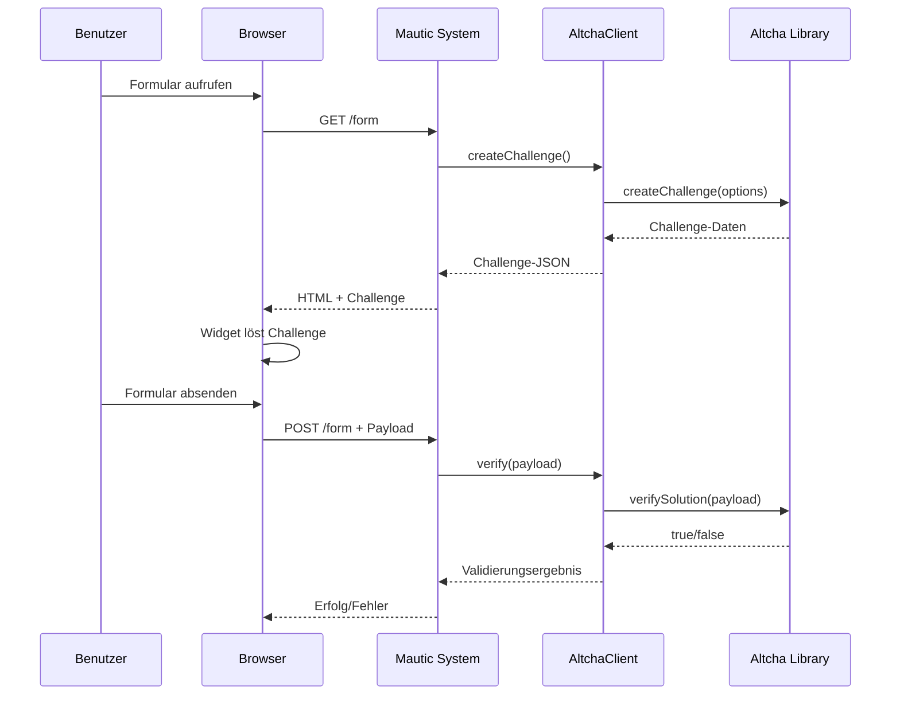

# Design Document: Altcha Integration

## Overview

Die Altcha-Integration erweitert das Mautic Multi-CAPTCHA Bundle um eine datenschutzfreundliche, selbst-gehostete CAPTCHA-Lösung. Im Gegensatz zu den bestehenden Integrationen (reCAPTCHA, hCaptcha, Turnstile) erfolgt die gesamte Challenge-Generierung und -Validierung lokal auf dem Server ohne externe API-Aufrufe. Dies macht die Lösung DSGVO-konform ohne Notwendigkeit für Explicit Consent.

### Key Design Principles

1. **Lokale Verarbeitung**: Alle Operationen (Challenge-Generierung, Validierung) erfolgen serverseitig
2. **Keine externen Abhängigkeiten**: Kein Laden von Drittanbieter-Skripten oder API-Aufrufe
3. **Konsistenz**: Folgt dem etablierten Muster der bestehenden CAPTCHA-Integrationen
4. **Kompatibilität**: Unterstützt Mautic 5, 6 und 7
5. **Flexibilität**: Unterstützt sowohl sichtbaren als auch unsichtbaren (invisible) Modus

## Architecture

Die Altcha-Integration folgt der etablierten Architektur des Bundles mit folgenden Hauptkomponenten:

```
MauticMultiCaptchaBundle/
├── Integration/
│   └── AltchaIntegration.php          # Plugin-Konfiguration
├── Service/
│   └── AltchaClient.php               # Challenge-Generierung und Validierung
├── Form/Type/
│   └── AltchaType.php                 # Formularfeld-Konfiguration
├── EventListener/
│   └── AltchaFormSubscriber.php       # Event-Handling und Validierung
├── Resources/views/Integration/
│   └── altcha.html.twig               # Widget-Template
├── Assets/img/
│   └── altcha.png                     # Plugin-Icon
└── Translations/en_US/
    └── messages.ini                   # Übersetzungen (erweitert)
```

### Component Interaction Flow



## Components and Interfaces

### 1. AltchaIntegration

**Zweck**: Registriert die Altcha-Integration im Mautic-Plugin-System und definiert Konfigurationsfelder.

**Extends**: `Mautic\PluginBundle\Integration\AbstractIntegration`

**Key Methods**:
- `getName(): string` - Gibt "Altcha" zurück
- `getDisplayName(): string` - Gibt "Altcha" zurück
- `getAuthenticationType(): string` - Gibt "none" zurück
- `getRequiredKeyFields(): array` - Definiert HMAC-Key als erforderliches Feld

**Configuration Fields**:
- `hmac_key` (string, required): Der geheime HMAC-Schlüssel für Challenge-Signierung

### 2. AltchaClient

**Zweck**: Kapselt die Interaktion mit der Altcha-PHP-Bibliothek für Challenge-Generierung und -Validierung.

**Dependencies**:
- `IntegrationHelper`: Zugriff auf Plugin-Konfiguration
- `AltchaOrg\Altcha\Altcha`: Die Altcha-PHP-Bibliothek

**Key Methods**:

```php
public function __construct(IntegrationHelper $integrationHelper)
```
- Initialisiert den Altcha-Client mit HMAC-Key aus der Konfiguration

```php
public function createChallenge(int $maxNumber, int $expiresInSeconds): array
```
- Generiert eine neue Challenge
- Parameter:
  - `$maxNumber`: Maximale Zufallszahl (1000-1000000)
  - `$expiresInSeconds`: Ablaufzeit in Sekunden (10-300)
- Returns: Array mit algorithm, challenge, salt, signature

```php
public function verify(string $payload): bool
```
- Validiert einen Challenge-Payload
- Parameter:
  - `$payload`: JSON-String mit der Lösung
- Returns: true bei erfolgreicher Validierung, false sonst

**Error Handling**:
- Wirft `\RuntimeException` wenn HMAC-Key nicht konfiguriert ist
- Wirft `\JsonException` bei ungültigem JSON-Payload
- Loggt Fehler über Mautic-Logger

### 3. AltchaType

**Zweck**: Definiert die Formularfeld-Konfiguration für Altcha-Felder.

**Extends**: `Symfony\Component\Form\AbstractType`

**Form Fields**:

```php
public function buildForm(FormBuilderInterface $builder, array $options)
```

Fügt folgende Felder hinzu:
- `maxNumber` (NumberType): Maximale Zufallszahl (Default: 50000, Range: 1000-1000000)
- `expires` (NumberType): Ablaufzeit in Sekunden (Default: 120, Range: 10-300)
- `invisible` (YesNoButtonGroupType): Invisible-Modus aktivieren (Default: false)

### 4. AltchaFormSubscriber

**Zweck**: Registriert das Altcha-Feld im Formular-Builder und führt die Validierung durch.

**Implements**: `Symfony\Component\EventDispatcher\EventSubscriberInterface`

**Dependencies**:
- `EventDispatcherInterface`: Event-Dispatching
- `AltchaClient`: Challenge-Validierung
- `LeadModel`: Lead-Verwaltung
- `IntegrationHelper`: Plugin-Konfiguration

**Subscribed Events**:
- `FormEvents::FORM_ON_BUILD`: Registriert Altcha-Feld
- `CaptchaEvents::ALTCHA_ON_FORM_VALIDATE`: Führt Validierung durch

**Key Methods**:

```php
public function onFormBuild(FormBuilderEvent $event): void
```
- Prüft ob Integration konfiguriert ist
- Registriert "plugin.altcha" Formularfeld
- Konfiguriert Template und Builder-Optionen

```php
public function onFormValidate(ValidationEvent $event): void
```
- Extrahiert Payload aus Form-Submission
- Ruft `AltchaClient::verify()` auf
- Bei Fehler: Setzt Validierungsfehler und löscht erstellten Lead

### 5. altcha.html.twig

**Zweck**: Rendert das Altcha-Widget im Formular.

**Template Variables**:
- `field`: Feld-Konfiguration
- `formName`: Formular-Name
- `containerAttributes`: Container-HTML-Attribute
- `inputAttributes`: Input-HTML-Attribute
- `labelAttributes`: Label-HTML-Attribute

**Widget Integration**:
- Bindet Altcha-Widget-Skript von CDN ein: `https://cdn.jsdelivr.net/npm/altcha/dist/altcha.min.js`
- Rendert `<altcha-widget>` Custom Element
- Übergibt Challenge-Daten als JSON-Attribut
- Konfiguriert invisible-Modus wenn aktiviert

**Challenge-Generierung**:
- Challenge wird serverseitig beim Template-Rendering generiert
- Challenge-Daten werden als JSON in Template-Variable übergeben
- Widget erhält Challenge über `challengeurl` oder direkt als JSON

## Data Models

### Challenge Data Structure

```php
[
    'algorithm' => 'SHA-256',        // Hash-Algorithmus
    'challenge' => string,           // Base64-kodierte Challenge
    'salt' => string,                // Zufälliger Salt
    'signature' => string,           // HMAC-Signatur
    'maxnumber' => int,              // Maximale Zufallszahl
    'expires' => string              // ISO 8601 Ablaufzeit
]
```

### Payload Data Structure

```php
[
    'algorithm' => 'SHA-256',        // Hash-Algorithmus
    'challenge' => string,           // Original Challenge
    'number' => int,                 // Gefundene Lösung
    'salt' => string,                // Original Salt
    'signature' => string            // Original Signatur
]
```

### Field Configuration

```php
[
    'maxNumber' => int,              // 1000-1000000, Default: 50000
    'expires' => int,                // 10-300 Sekunden, Default: 120
    'invisible' => bool              // Default: false
]
```

## 
Correctness Properties

*A property is a characteristic or behavior that should hold true across all valid executions of a system-essentially, a formal statement about what the system should do. Properties serve as the bridge between human-readable specifications and machine-verifiable correctness guarantees.*

### Property 1: HMAC-Key Persistence

*For any* valid HMAC-Key string, when saved through the integration configuration, retrieving the configuration should return the same HMAC-Key value.

**Validates: Requirements 1.3**

**Rationale**: Dies ist ein Round-Trip-Property, das sicherstellt, dass die Konfiguration korrekt gespeichert und abgerufen wird.

### Property 2: maxNumber Range Validation

*For any* integer value, when setting the maxNumber field property, the system should accept values between 1000 and 1000000 (inclusive) and reject all other values.

**Validates: Requirements 2.4**

**Rationale**: Dies stellt sicher, dass die Bereichsvalidierung für alle möglichen Eingaben korrekt funktioniert.

### Property 3: Expires Range Validation

*For any* integer value, when setting the expires field property, the system should accept values between 10 and 300 (inclusive) and reject all other values.

**Validates: Requirements 2.5**

**Rationale**: Dies stellt sicher, dass die Ablaufzeit-Validierung für alle möglichen Eingaben korrekt funktioniert.

### Property 4: Challenge Structure Completeness

*For any* valid configuration parameters (maxNumber, expires), when generating a challenge, the returned data structure should contain all required fields: algorithm, challenge, salt, signature, maxnumber, and expires.

**Validates: Requirements 3.2, 3.3**

**Rationale**: Dies ist ein Invarianten-Property, das sicherstellt, dass jede generierte Challenge vollständig ist.

### Property 5: Valid Payload Acceptance

*For any* correctly generated challenge and its valid solution payload, when verifying the payload, the system should accept it and allow form submission.

**Validates: Requirements 4.1, 4.2**

**Rationale**: Dies ist ein Round-Trip-Property, das sicherstellt, dass gültige Lösungen immer akzeptiert werden.

### Property 6: Invalid Payload Rejection

*For any* payload with incorrect signature, wrong number, or manipulated data, when verifying the payload, the system should reject it and display an error message.

**Validates: Requirements 4.3**

**Rationale**: Dies ist ein Error-Condition-Property, das sicherstellt, dass ungültige Eingaben korrekt abgelehnt werden.

### Property 7: Lead Cleanup After Failed Validation

*For any* form submission with invalid Altcha payload, if a lead was created during processing, the system should automatically delete that lead after validation failure.

**Validates: Requirements 7.5**

**Rationale**: Dies stellt sicher, dass keine Spam-Leads in der Datenbank verbleiben.

### Property 8: Local Resource Loading

*For any* rendered Altcha widget template, all script sources should reference local or CDN URLs without third-party tracking domains.

**Validates: Requirements 8.1**

**Rationale**: Dies stellt sicher, dass keine externen Tracking-Skripte geladen werden, was DSGVO-Konformität gewährleistet.

## Error Handling

### Configuration Errors

1. **Missing HMAC-Key**:
   - Detection: Check in `AltchaClient::__construct()`
   - Handling: Throw `\RuntimeException` with message "Altcha HMAC key not configured"
   - User Impact: Integration wird nicht in Formular-Builder angezeigt

2. **Invalid HMAC-Key Format**:
   - Detection: Check in `AltchaClient::createChallenge()`
   - Handling: Catch exception from Altcha library, log error
   - User Impact: Challenge-Generierung schlägt fehl, Formular kann nicht geladen werden

3. **Missing Altcha Library**:
   - Detection: Class existence check in `AltchaClient::__construct()`
   - Handling: Throw `\RuntimeException` with installation instructions
   - User Impact: Plugin kann nicht aktiviert werden

### Runtime Errors

1. **Challenge Generation Failure**:
   - Detection: Exception from `Altcha::createChallenge()`
   - Handling: Log error, return empty array
   - User Impact: Widget wird nicht angezeigt, Formular kann nicht abgesendet werden
   - Fallback: Zeige generische Fehlermeldung

2. **Invalid Payload Format**:
   - Detection: JSON decode error in `AltchaClient::verify()`
   - Handling: Catch `\JsonException`, return false
   - User Impact: Validierung schlägt fehl, Fehlermeldung wird angezeigt

3. **Expired Challenge**:
   - Detection: Altcha library returns false
   - Handling: Return false from `verify()`
   - User Impact: Benutzer muss Formular neu laden und erneut absenden

4. **Signature Mismatch**:
   - Detection: Altcha library returns false
   - Handling: Return false from `verify()`
   - User Impact: Validierung schlägt fehl, Fehlermeldung wird angezeigt

### Error Messages

Alle Fehlermeldungen werden über das Mautic-Translation-System bereitgestellt:

```ini
strings.altcha.failure_message="Altcha verification failed. Please try again."
strings.altcha.expired_message="Altcha challenge expired. Please reload the form."
strings.altcha.config_error="Altcha is not properly configured. Please contact the administrator."
strings.altcha.library_missing="Altcha library not installed. Run: composer require altcha-org/altcha"
```

### Logging

Alle Fehler werden über den Mautic-Logger geloggt:

```php
$this->logger->error('Altcha challenge generation failed', [
    'exception' => $e->getMessage(),
    'maxNumber' => $maxNumber,
    'expires' => $expiresInSeconds
]);
```

## Testing Strategy

### Unit Testing

Die Unit-Tests fokussieren sich auf isolierte Komponenten und spezifische Beispiele:

**AltchaClient Tests**:
- Test: HMAC-Key wird korrekt aus Konfiguration geladen
- Test: Exception wird geworfen wenn HMAC-Key fehlt
- Test: Challenge enthält alle erforderlichen Felder
- Test: Gültiger Payload wird akzeptiert
- Test: Ungültiger Payload wird abgelehnt
- Test: JSON-Decode-Fehler werden korrekt behandelt

**AltchaIntegration Tests**:
- Test: getName() gibt "Altcha" zurück
- Test: getRequiredKeyFields() enthält "hmac_key"
- Test: Integration erscheint in Plugin-Liste

**AltchaType Tests**:
- Test: Form enthält maxNumber, expires, invisible Felder
- Test: Default-Werte sind korrekt gesetzt
- Test: Validierungs-Constraints sind korrekt konfiguriert

**AltchaFormSubscriber Tests**:
- Test: Feld wird nur registriert wenn Integration konfiguriert ist
- Test: Validierungs-Event wird korrekt abonniert
- Test: Lead wird nach fehlgeschlagener Validierung gelöscht

### Property-Based Testing

Property-Based Tests verwenden die **fast-check** Bibliothek für PHP (oder **PHPUnit-Quickcheck** als Alternative) um universelle Eigenschaften über viele zufällige Eingaben zu verifizieren.

**Framework**: PHPUnit mit quickcheck-php Extension

**Configuration**: Minimum 100 Iterationen pro Property-Test

**Property Tests**:

1. **Property Test: HMAC-Key Persistence** (Property 1)
   - Generator: Zufällige Strings (20-64 Zeichen, alphanumerisch)
   - Test: Speichern und Abrufen ergibt identischen Wert
   - Validates: Requirements 1.3

2. **Property Test: maxNumber Range Validation** (Property 2)
   - Generator: Zufällige Integers (-1000000 bis 2000000)
   - Test: Werte 1000-1000000 werden akzeptiert, andere abgelehnt
   - Validates: Requirements 2.4

3. **Property Test: Expires Range Validation** (Property 3)
   - Generator: Zufällige Integers (0 bis 500)
   - Test: Werte 10-300 werden akzeptiert, andere abgelehnt
   - Validates: Requirements 2.5

4. **Property Test: Challenge Structure Completeness** (Property 4)
   - Generator: Zufällige maxNumber (1000-1000000), expires (10-300)
   - Test: Generierte Challenge enthält alle Pflichtfelder
   - Validates: Requirements 3.2, 3.3

5. **Property Test: Valid Payload Acceptance** (Property 5)
   - Generator: Zufällige gültige Challenge-Payload-Paare
   - Test: Validierung gibt true zurück
   - Validates: Requirements 4.1, 4.2

6. **Property Test: Invalid Payload Rejection** (Property 6)
   - Generator: Zufällige Payloads mit manipulierten Daten
   - Test: Validierung gibt false zurück
   - Validates: Requirements 4.3

7. **Property Test: Lead Cleanup After Failed Validation** (Property 7)
   - Generator: Zufällige ungültige Payloads
   - Test: Lead existiert nicht mehr nach Validierung
   - Validates: Requirements 7.5

8. **Property Test: Local Resource Loading** (Property 8)
   - Generator: Zufällige Widget-Konfigurationen
   - Test: Alle Skript-URLs sind lokal oder von erlaubten CDNs
   - Validates: Requirements 8.1

### Integration Testing

Integration-Tests werden manuell durchgeführt:

1. **Mautic 5/6/7 Kompatibilität**: Manuelle Installation und Funktionstest in allen Versionen
2. **Formular-Integration**: Manueller Test des Widget-Renderings und der Submission
3. **Invisible-Modus**: Manueller Test der automatischen Challenge-Lösung
4. **Browser-Kompatibilität**: Manueller Test in Chrome, Firefox, Safari, Edge

### Test Coverage Goals

- Unit Test Coverage: Minimum 80% Code Coverage
- Property Test Coverage: Alle 8 definierten Properties
- Integration Test Coverage: Alle kritischen User-Flows

## Implementation Notes

### Composer Dependency

Die `composer.json` muss erweitert werden:

```json
{
    "require": {
        "altcha-org/altcha": "^1.0"
    }
}
```

### Service Registration

In `Config/config.php` müssen folgende Services registriert werden:

```php
"mautic.altcha.service.altcha_client" => [
    "class" => AltchaClient::class,
    "arguments" => [
        "mautic.helper.integration"
    ]
],

"mautic.altcha.event_listener.form_subscriber" => [
    "class" => AltchaFormSubscriber::class,
    "arguments" => [
        "event_dispatcher",
        "mautic.altcha.service.altcha_client",
        "mautic.lead.model.lead",
        "mautic.helper.integration"
    ]
],

"mautic.integration.altcha" => [
    "class" => AltchaIntegration::class,
    "arguments" => $defaultIntegrationArguments
]
```

### Event Registration

In `CaptchaEvents.php`:

```php
public const ALTCHA_ON_FORM_VALIDATE = "mautic.plugin.altcha.on_form_validate";
```

### Translation Keys

In `Translations/en_US/messages.ini`:

```ini
; altcha
mautic.form.field.type.plugin.altcha="Altcha"
strings.altcha.plugin.name="Altcha"
strings.altcha.settings.hmac_key="HMAC Key"
strings.altcha.settings.max_number="Max Number"
strings.altcha.settings.max_number.tooltip="Maximum random number for challenge (1000-1000000)"
strings.altcha.settings.expires="Challenge Expires (seconds)"
strings.altcha.settings.expires.tooltip="Challenge expiration time in seconds (10-300)"
strings.altcha.settings.invisible="Invisible Mode"
strings.altcha.settings.invisible.tooltip="Enable invisible CAPTCHA mode"
strings.altcha.failure_message="Altcha verification failed. Please try again."
strings.altcha.expired_message="Altcha challenge expired. Please reload the form."
strings.altcha.config_error="Altcha is not properly configured."
```

### Widget CDN

Das Altcha-Widget wird von folgendem CDN geladen:

```
https://cdn.jsdelivr.net/npm/altcha/dist/altcha.min.js
```

Alternative: Lokales Hosting der Widget-Datei im `Assets/js/` Verzeichnis für vollständige Unabhängigkeit.

### Challenge Endpoint

Für optimale Performance sollte ein dedizierter Endpoint für Challenge-Generierung erstellt werden:

```
GET /mautic/altcha/challenge?maxNumber=50000&expires=120
```

Response:
```json
{
    "algorithm": "SHA-256",
    "challenge": "...",
    "salt": "...",
    "signature": "...",
    "maxnumber": 50000
}
```

Dies ermöglicht dynamisches Nachladen von Challenges ohne Seiten-Reload.

## Security Considerations

1. **HMAC-Key Storage**: Der HMAC-Key sollte sicher in der Mautic-Konfiguration gespeichert werden (verschlüsselt)
2. **Challenge Expiration**: Challenges sollten eine angemessene Ablaufzeit haben (Default: 120 Sekunden)
3. **Rate Limiting**: Implementierung von Rate Limiting für Challenge-Generierung empfohlen
4. **Replay Attack Prevention**: Jede Challenge sollte nur einmal verwendbar sein (Token-Tracking)
5. **Input Validation**: Alle Eingaben (maxNumber, expires) müssen serverseitig validiert werden

## Performance Considerations

1. **Challenge Generation**: Lokale Generierung ist schneller als externe API-Aufrufe
2. **Caching**: Keine Caching-Strategie erforderlich, da jede Challenge einzigartig ist
3. **Database Impact**: Minimaler Impact, nur bei fehlgeschlagener Validierung (Lead-Löschung)
4. **Widget Loading**: CDN-Hosting sorgt für schnelles Laden, Alternative: lokales Hosting

## Future Enhancements

1. **Custom Styling**: Ermögliche Custom CSS für Widget-Styling
2. **Multiple Languages**: Erweitere Übersetzungen für weitere Sprachen
3. **Analytics**: Tracking von Challenge-Erfolgsraten und Validierungs-Metriken
4. **Advanced Configuration**: Zusätzliche Optionen wie Custom Algorithms
5. **API Endpoint**: RESTful API für externe Challenge-Generierung
