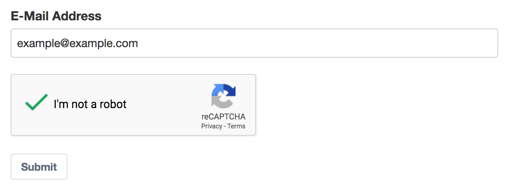
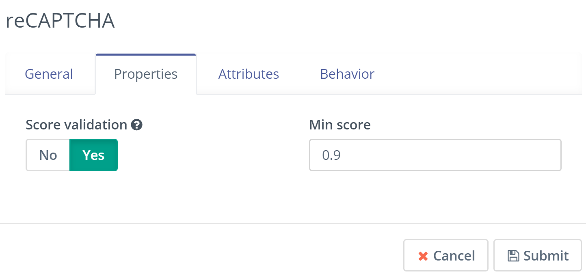

# Mautic (re*)CAPTCHA Plugin

Forked from KVZ's variant (with additional query to load Google's stuff only after clicking)

This project has been pruned to ONLY support Mautic 6.

Additional captcha providers are planned. See [ROADMAP](ROADMAP)

## Installation
TBD

## Configuration
Navigate to the Plugins page and click "Install/Upgrade Plugins". You should now see a "reCAPTCHA" plugin. Open it to configure site key and site secret.

## Usage in Mautic Form
Add "reCAPTCHA" field to the Form and save changes.

## Score validation

Recaptcha will rank traffic and interactions based on a score of 0.0 to 1.0, with a 1.0 being a good interaction and scores closer to 0.0 indicating a good likelihood that the traffic was generated by bots

