# Mautic Multi-CAPTCHA Plugin

This project has been pruned to **ONLY** support Mautic 6.
You _can_ use it with Mautic 5 as well, but we do not officially support this.
Any issues opened from Mautic 5 will be regarded as spam.

## Installation
 1. Execute `composer require firemultimedia/mautic-multi-captcha-bundle` in the main directory of the mautic installation
 2. flush the cache `php bin/console cache:clear`.
 3. Navigate to the Plugins page and click "Install/Upgrade Plugins".

You should now see three new plug-ins.

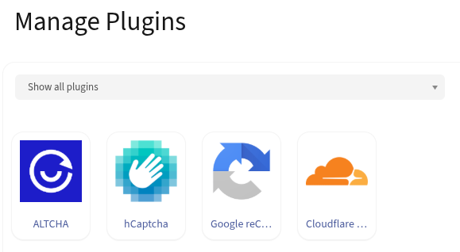

## Configuration
### hCaptcha
Collect your keys from [hCaptcha](https://dashboard.hcaptcha.com/sites/new) and place them here:

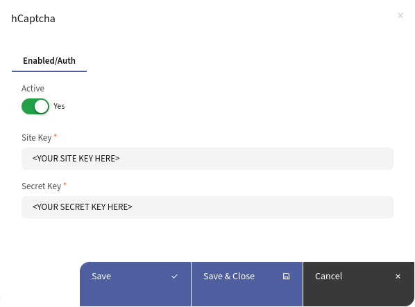

The hCaptcha field in the Mautic form can be configured under the "Properties" tab.

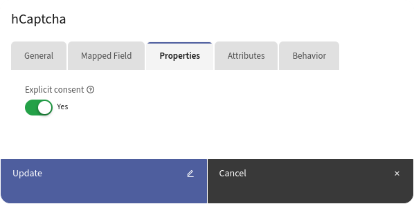

### Google reCAPTCHA
Collect your keys from [Google reCAPTCHA](https://www.google.com/recaptcha/admin/create) and place them here:

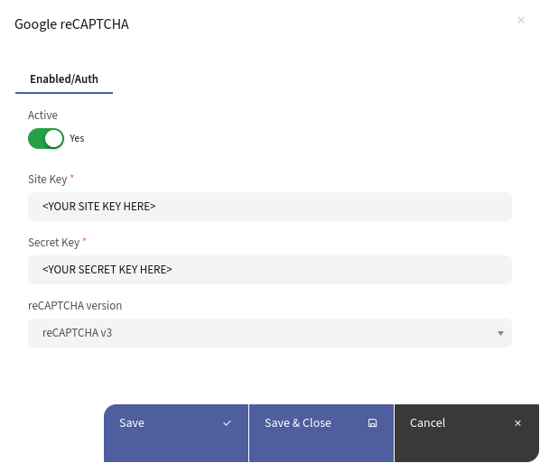

The Google reCAPTCHA field in the Mautic form can be configured under the "Properties" tab. Google reCAPTCHA will rank traffic and interactions based on a score of 0.0 to 1.0, with a 1.0 being a good interaction and scores closer to 0.0 indicating a good likelihood that the traffic was generated by bots.

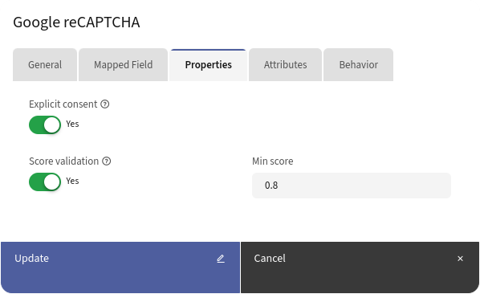

### Cloudflare Turnstile
Collect your keys from the [Cloudflare dasboard](https://dash.cloudflare.com/) (under Turnstile -> Add widget) and place them here:

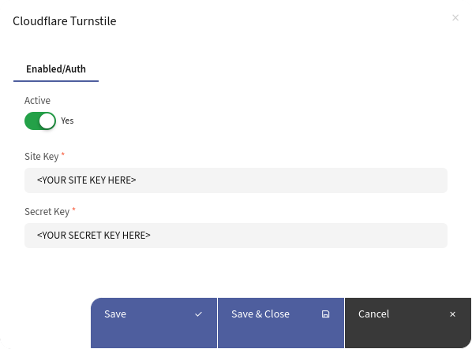

The Cloudflare Turnstile field in the Mautic form can be configured under the "Properties" tab.

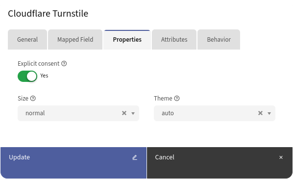

## Usage in Mautic Form
### hCaptcha
Add the "hCaptcha" field to the form and save changes.

| Explicit consent mode:                                                    | Implicit consent mode:                                                                                               |
|---------------------------------------------------------------------------|----------------------------------------------------------------------------------------------------------------------|
| 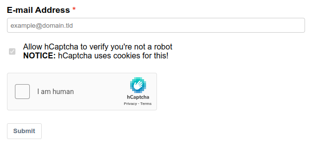 | ") |

### Google reCAPTCHA v2
Add the "Google reCAPTCHA" field to the form and save changes.

| Explicit consent mode:                                                                             | Implicit consent mode:                                                                                                                        |
|----------------------------------------------------------------------------------------------------|-----------------------------------------------------------------------------------------------------------------------------------------------|
| 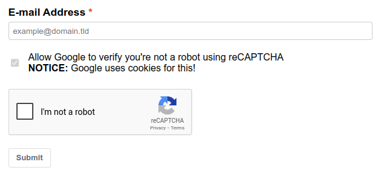 | ") |

### Google reCAPTCHA v3
Add the "Google reCAPTCHA" field to the form and save changes.

| Explicit consent mode:                                                                             | Implicit consent mode:                                                                                                                        |
|----------------------------------------------------------------------------------------------------|-----------------------------------------------------------------------------------------------------------------------------------------------|
| 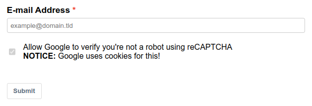 | ") |

### Cloudflare Turnstile
Add the "Cloudflare Turnstile" field to the form and save changes.

| Explicit consent mode:                                                                             | Implicit consent mode:                                                                                                                        |
|----------------------------------------------------------------------------------------------------|-----------------------------------------------------------------------------------------------------------------------------------------------|
| 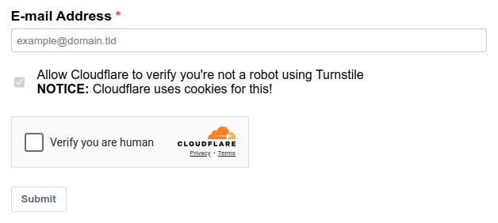 | ") |
