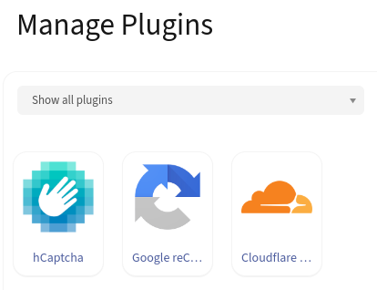

# Mautic Multi-CAPTCHA Plugin
[](LICENSE)
[](https://www.mautic.org/mixin/recaptcha/)
[](https://www.mautic.org/mixin/recaptcha/)

This project has been pruned to **ONLY** support Mautic 6 and has been tested on Mautic 7.0.0-alpha.
You _can_ use it with Mautic 5 as well, but we do not officially support this.
Any issues opened from Mautic 5 will be regarded as spam.

## Supported CAPTCHA Solutions

This bundle provides four CAPTCHA options to protect your Mautic forms:

- **hCaptcha**: Privacy-focused alternative to reCAPTCHA with accessibility features
- **Google reCAPTCHA**: Industry-standard CAPTCHA with v2 (checkbox) and v3 (invisible scoring) options
- **Cloudflare Turnstile**: Modern, privacy-respecting CAPTCHA from Cloudflare
- **Altcha**: Self-hosted, GDPR-compliant CAPTCHA with no external dependencies (recommended for privacy-sensitive applications)

## Installation
 1. Execute `composer require firemultimedia/mautic-multi-captcha-bundle` in the main directory of the mautic installation
 2. flush the cache `php bin/console cache:clear`.
 3. Navigate to the Plugins page and click "Install/Upgrade Plugins".

You should now see four new plug-ins: hCaptcha, Google reCAPTCHA, Cloudflare Turnstile, and Altcha.



## Configuration
### hCaptcha
Collect your keys from [hCaptcha](https://dashboard.hcaptcha.com/sites/new) and place them here:


The hCaptcha field in the Mautic form can be configured under the "Properties" tab.


### Google reCAPTCHA
Collect your keys from [Google reCAPTCHA](https://www.google.com/recaptcha/admin/create) and place them here:


The Google reCAPTCHA field in the Mautic form can be configured under the "Properties" tab. Google reCAPTCHA will rank traffic and interactions based on a score of 0.0 to 1.0, with a 1.0 being a good interaction and scores closer to 0.0 indicating a good likelihood that the traffic was generated by bots.


### Cloudflare Turnstile
Collect your keys from the [Cloudflare dasboard](https://dash.cloudflare.com/) (under Turnstile -> Add widget) and place them here:


The Cloudflare Turnstile field in the Mautic form can be configured under the "Properties" tab.


### Altcha
Altcha is a privacy-friendly, self-hosted CAPTCHA solution that performs all validation locally on your server without external API calls. This makes it GDPR-compliant without requiring explicit user consent.

#### Configuration Steps

1. **Generate an HMAC Key**: Create a secure random string to use as your HMAC key. You can generate one using:
   ```bash
   openssl rand -hex 32
   ```

2. **Configure the Plugin**: Navigate to the Altcha plugin configuration and enter your HMAC key:


3. **Add to Form**: The Altcha field can now be added to your Mautic forms.

#### Field Configuration

The Altcha field in the Mautic form can be configured under the "Properties" tab with the following options:


- **Max Number** (1000-1000000, default: 50000): Controls the difficulty of the challenge. Higher numbers make the challenge harder to solve but take longer.
- **Challenge Expires** (10-300 seconds, default: 120): How long the challenge remains valid before expiring.
- **Invisible Mode** (default: off): When enabled, the CAPTCHA widget is hidden and automatically solves the challenge in the background without user interaction.

#### Invisible Mode

Altcha supports an invisible mode where the challenge is solved automatically in the background without displaying a visible widget to the user. This provides a seamless user experience while still protecting against spam.

To enable invisible mode:
1. Edit the Altcha field properties in your form
2. Toggle "Invisible Mode" to "Yes"
3. Save the form

When invisible mode is enabled, the challenge is solved automatically when the form loads, and users can submit the form without any additional interaction.

#### GDPR Compliance

Altcha is designed with privacy in mind and offers significant advantages for GDPR compliance:

- **No External API Calls**: All challenge generation and validation happens locally on your server
- **No Third-Party Scripts**: The widget can be loaded from your own server or a CDN without tracking
- **No Cookies or Storage**: Altcha does not use cookies or browser storage
- **No User Data Collection**: No personal data is collected or transmitted to third parties
- **No Explicit Consent Required**: Since no external services are used, explicit consent is not necessary under GDPR

This makes Altcha an ideal choice for organizations that need to comply with strict data protection regulations while still protecting their forms from spam and abuse.

#### API Endpoint

The plugin provides a REST API endpoint for dynamic challenge generation, which solves caching issues in Mautic forms:

**Endpoint**: `GET /altcha/api/challenge`

**Parameters**: None (uses secure default values)
- `maxNumber`: 100000 (fixed for security)
- `expires`: 300 seconds (fixed for security)

**Example Request**:
```bash
curl "https://your-mautic.com/altcha/api/challenge"
```

**Example Response**:
```json
{
    "algorithm": "SHA-256",
    "challenge": "abc123...",
    "maxnumber": 50000,
    "salt": "def456...",
    "signature": "ghi789..."
}
```

This API endpoint is automatically used by the Altcha widget via the `challengeurl` attribute to ensure fresh challenges are generated for each form load, preventing caching issues. The widget handles all the complexity internally - no custom JavaScript required.


## Usage in Mautic Form
### hCaptcha
Add the "hCaptcha" field to the form and save changes.

| Explicit consent mode:                                                    | Implicit consent mode:                                                                                               |
|---------------------------------------------------------------------------|----------------------------------------------------------------------------------------------------------------------|
|  | ") |

### Google reCAPTCHA v2
Add the "Google reCAPTCHA" field to the form and save changes.


| Explicit consent mode:                                                                             | Implicit consent mode:                                                                                                                        |
|----------------------------------------------------------------------------------------------------|-----------------------------------------------------------------------------------------------------------------------------------------------|
|  | ") |

### Google reCAPTCHA v3
Add the "Google reCAPTCHA" field to the form and save changes.


| Explicit consent mode:                                                                             | Implicit consent mode:                                                                                                                        |
|----------------------------------------------------------------------------------------------------|-----------------------------------------------------------------------------------------------------------------------------------------------|
|  | ") |

### Cloudflare Turnstile
Add the "Cloudflare Turnstile" field to the form and save changes.


| Explicit consent mode:                                                                             | Implicit consent mode:                                                                                                                        |
|----------------------------------------------------------------------------------------------------|-----------------------------------------------------------------------------------------------------------------------------------------------|
|  | ") |

### Altcha
Add the "Altcha" field to the form and save changes.

**Note**: Unlike other CAPTCHA solutions, Altcha does not require explicit consent mode because it does not use external services or collect user data. All processing happens locally on your server.

| Standard mode:                                                                             | Invisible mode:                                                                                                                        |
|--------------------------------------------------------------------------------------------|----------------------------------------------------------------------------------------------------------------------------------------|
|  | ") |

In standard mode, users see a checkbox-style widget that automatically solves the challenge. In invisible mode, the challenge is solved in the background without any visible widget.
